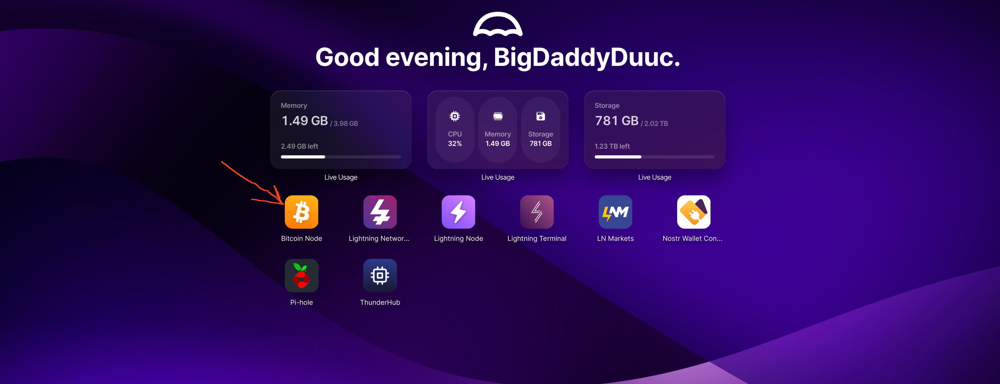
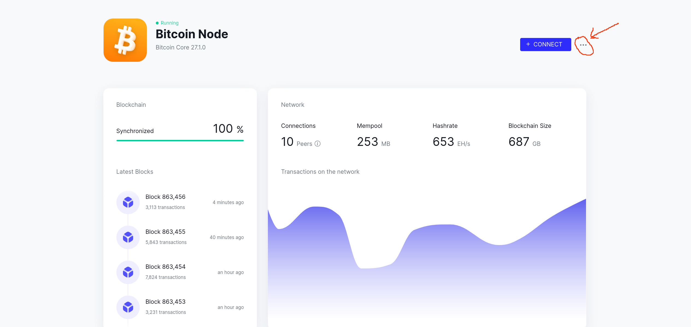
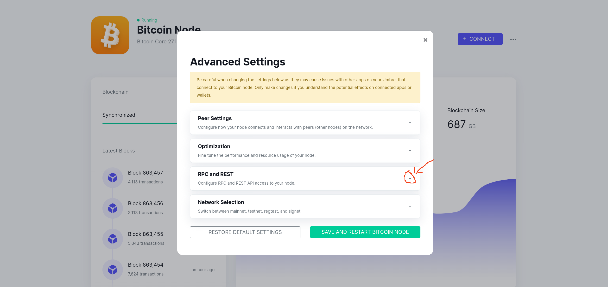
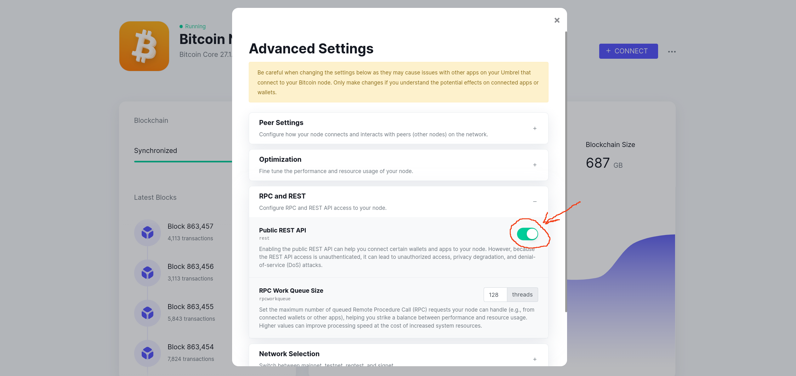

<h2 align="center">Enable RPC Function</h2>
 
 
 
 

<h3 align="center">Step #1</h3>
<h3 align="center">Login to Bitcoin Core Node application through umbrel </h3>
    

    <picture>
        <source media="(prefers-color-scheme: dark)" srcset="./images/umbrel_main.png">
        
    </picture>
    

</h3>
 
 
<h3 align="center">Step #2...Press 3 dots </h3>
    

    <picture>
        <source media="(prefers-color-scheme: dark)" srcset="./images/umbrel_BitcoinNode_01.png">
        
    </picture>
    

</h3>
 
 
<h3 align="center">Step #3...Press "Advanced Settings"  </h3>
    

    <picture>
        <source media="(prefers-color-scheme: dark)" srcset="./images/umbrel_BitcoinNode_02.png">
        
    </picture>
    

</h3>
 
 
<h3 align="center">Step #4 Press "+" symbol to expand "RPC and REST" section </h3>
    

    <picture>
        <source media="(prefers-color-scheme: dark)" srcset="./images/umbrel_BitcoinNode_03.png">
        
    </picture>
    

</h3>
 
 
<h3 align="center">Step #5 Press toggle on so it shows green to enable "RPC and REST"</h3>
    

    <picture>
        <source media="(prefers-color-scheme: dark)" srcset="./images/umbrel_BitcoinNode_04.png">
        
    </picture>
    

</h3>

 
 
 
 

### [Next](https://github.com/Juniorduc44/troubleshooting/blob/main/umbrelBitcoinRPC/loadPythonEnv.md)
## Return to [Start](https://github.com/Juniorduc44/troubleshooting/tree/main/umbrelBitcoinRPC)

